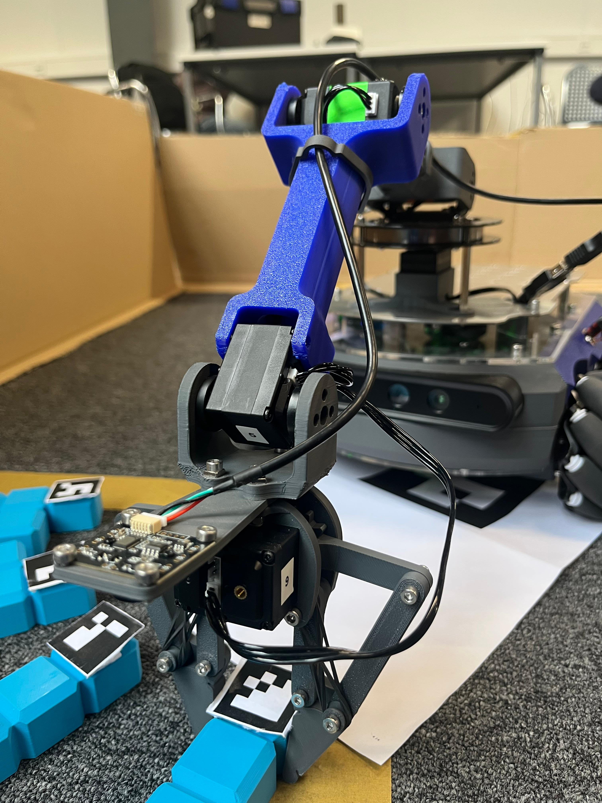

# tetris-assembly
**Group 4 of the 2026 edition of the "AE4ASM527 - Spatial AI for Industrial Automation" course at TU Delft**



# Packages:
## data_collection
- arm_teleop
- data_collector

See details in `data_collection/README.md`

## slam
Run with:
```bash
ros2 launch slam slam.launch.py
```

Publishes an occupancy grid on `/map_lidar` and the `map -> odom` transform using `slam_toolbox`.

save map on the Mirte with 
```bash
ros2 run nav2_map_server map_saver_cli -t /map_lidar \
  -f /home/mirte/mirte_ws/src/mirte_navigation/maps/default
```

## navigation
TODO

## detection
TODO

## grasping
- providing `/pick_tile`, `drop_tile` actions and the `move_to_detection_pose` service

See details in `grasping/README.md`

## orchestration
Run with:
```bash
ros2 launch orchestration orchestrator.launch.py
```

- contains the mapping of Aruko/tile ID to target position in `TILE_TARGETS` at the top
- calls other services/actions (nodes need to be running)
- robust to failure of steps through retrying, skipping (or quitting) the individual navigation, detection and grasping steps
- to retry: `ros2 topic pub --once /orchestrator/control std_msgs/String "data: 'r'"`
- to skip: `ros2 topic pub --once /orchestrator/control std_msgs/String "data: 's'"`
- to quit: `ros2 topic pub --once /orchestrator/control std_msgs/String "data: 'q'"`