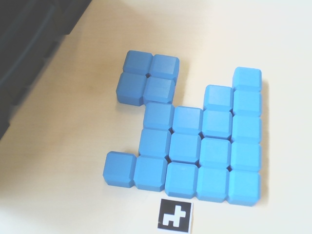
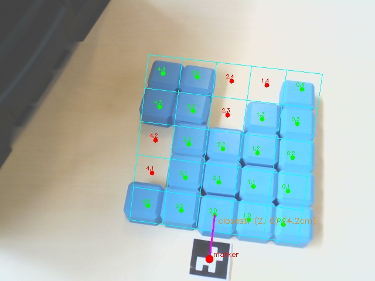

# Detection Package

Part of **tetROS**, a robotic system for autonomous Tetris assembly using the MIRTE Master robot.

This package is responsible for detecting ArUco markers in the scene, estimating their 3D pose relative to the camera, and publishing their position in the global `map` frame so that other nodes (navigation, gripper) can act on them.

---

## Overview

The detection node subscribes to the gripper camera image stream, runs ArUco marker detection on every N-th frame, and uses `solvePnP` to compute the 3D pose of any detected marker relative to the camera. It then broadcasts this as a TF transform and publishes the marker's pose in the `map` frame.

---

## How It Works

### 1. ArUco Detection

Each incoming camera frame is converted to grayscale and passed to OpenCV's ArUco detector (`DICT_4X4_1000`). This dictionary supports marker IDs 0–999, though only IDs 0–9 are used in this project.

### 2. Pose Estimation via solvePnP

For each detected marker, `cv2.solvePnP` computes the 3D position and orientation of the marker relative to the camera. It does this by matching:
- The known real-world 3D corners of the marker (based on its physical size in meters)
- The 2D pixel coordinates of those corners as detected in the image

The result is a rotation vector and translation vector describing where the marker is in camera space.

### 3. TF Broadcasting

The computed pose is broadcast as a TF transform:

```
camera_frame (default_cam) → aruco_marker_N
```

This adds the marker as a new frame in the TF tree.

### 4. Map Frame Lookup

Once the transform is broadcast, the node looks up the full chain from `map` to the marker:

```
map → odom → base_link → ... → wrist → default_cam → aruco_marker_N
```

The `wrist → default_cam` link is provided by a static transform publisher in the launch file (see below). TF2 chains all transforms automatically — the detection node just requests the final result.

### 5. Publishing

The marker's pose in the `map` frame is published as a `PoseStamped` message on `/detection/marker_pose`. The `z` field of the position is repurposed to carry the `marker_id` since the actual Z value is not required downstream.

---

## TF Tree & The `default_cam` Fix

The MIRTE Master URDF defines the gripper camera frame as `gripper_camera_link`. However, the camera driver publishes images with `frame_id = default_cam`. This name mismatch breaks the TF chain — `default_cam` has no parent in the tree, so any `lookup_transform` to `map` fails.

The correct upstream fix was pushed to `mirte-ros-packages` partway through the project, too late to safely pull and rebuild on the physical robot before the exam.

**Workaround:** A static transform publisher is included in the launch file that manually links `default_cam` to `wrist` using the exact physical offset defined in the URDF (see [mirte-ros-package/../arm.xacro](https://github.com/mirte-robot/mirte-ros-packages/blob/main/mirte_description/mirte_master_description/urdf/arm.xacro)
  lines 587–593):

```xml
<joint name="gripper_camera_joint" type="fixed">
    <origin xyz="0.027 0 -0.067" rpy="1.5707963267949 0 1.5707963267949" />
    <parent link="wrist" />
    <child link="gripper_camera_link" />
</joint>
```

This gives the same result as the upstream fix without requiring a system update.

---

## Marker Configuration

Markers are defined in `MARKER_CONFIG` at the top of `detection.py`. Each entry specifies:

| Field | Description |
|---|---|
| `name` | Human-readable label |
| `size_m` | Physical marker size in meters (used by solvePnP) |
| `target_offset` | Intended navigation offset (not yet consumed by this node) |
| `target_yaw_offset` | Intended heading offset (not yet consumed by this node) |

Currently only `size_m` is read by the detection node. The offset fields are intended for a downstream navigation node that consumes `/detection/marker_pose`.

| ID | Name | Size |
|---|---|---|
| 0 | tetris_grid | 10 cm |
| 1–8 | Block | 3 cm |
| 9 | storage_area | 10 cm |

---

## Topics

### Subscribed

| Topic | Type | Description |
|---|---|---|
| `/gripper_camera/image_raw/compressed` | `CompressedImage` | Gripper camera stream |
| `/gripper_camera/camera_info` | `CameraInfo` | Camera intrinsics (if not using hardcoded values) |
| `/detection/target_marker_ids` | `Int32MultiArray` | Which marker IDs to actively look for |

### Published

| Topic | Type | Description |
|---|---|---|
| `/detection/marker_pose` | `PoseStamped` | Marker pose in `map` frame (z = marker_id A bit of a hacky approach) |
| `/detection/found_marker_id` | `Int32` | ID of successfully detected marker (We don't really need this topic anymore as we package the marker ID inside the z coordinate of `/detection/marker_pose`) |

---

## Parameters

| Parameter | Default | Description |
|---|---|---|
| `image_topic` | `/gripper_camera/image_raw/compressed` | Camera topic to subscribe to |
| `use_compressed_img` | `True` | Whether to expect a compressed image |
| `camera_info_topic` | `/gripper_camera/camera_info` | Camera info topic |
| `use_hardcoded_camera_info` | `True` | Use calibrated values instead of subscribing to camera info |
| `fallback_camera_k` | *(calibrated values)* | Camera matrix (3x3 flattened) |
| `fallback_camera_d` | *(calibrated values)* | Distortion coefficients |
| `process_every_n` | `6` | Process only every N-th frame to reduce CPU load |
| `aruco_dict` | `DICT_4X4_1000` | ArUco dictionary to use |

Parameters can be overwritten at launch:
```bash
ros2 run detection detection --ros-args -p process_every_n:=3
```

---

## Launch

```bash
ros2 launch detection detection.launch.py
```

This starts both the detection node and the static transform publisher for `wrist → default_cam`.

---

## Targeting Specific Markers

The detection node only processes markers whose IDs are in the active target set. To set which markers to look for at runtime:

```bash
# Look for block markers 1 and 2
ros2 topic pub --once /detection/target_marker_ids std_msgs/Int32MultiArray "data: [1, 2]"

# Look for the tetris grid
ros2 topic pub --once /detection/target_marker_ids std_msgs/Int32MultiArray "data: [0]"
```

An empty set means no markers are processed.

---


## Grid Analysis – Proof of Concept (`test_grid.py`)

`test_grid.py` is a proof-of-concept for the grid occupancy analysis. It is not implemented into the ROS and does not communicate with any ROS nodes (yet). It takes a single image file as input and outputs an occupancy grid directly to the terminal and as a debug image.

The script detects the ArUco marker in the image, uses `solvePnP` to recover the camera pose, and projects a configurable 5×5 grid into the image plane using the calibrated camera intrinsics. Each cell is sampled in HSV space to determine whether a blue Tetris block is present or if the cell is empty.

**Usage:**
```bash
python3 occupancy_grid.py --image ../compressed_img.jpeg
```

**Example output:**
```
Occupancy (O=occupied, .=empty):
  O  O  O  O  O
  O  O  O  O  .
  O  O  O  .  .
  O  O  O  O  O
  O  .  .  O  O

Missing cells: [(1, 4), (2, 3), (2, 4), (4, 1), (4, 2)]
```

| Input image | Debug overlay |
|---|---|
|  |  |

Green dots indicate occupied cells, red dots indicate empty cells. The cyan grid lines are projected from the marker's coordinate frame into the image using the calibrated camera matrix.
